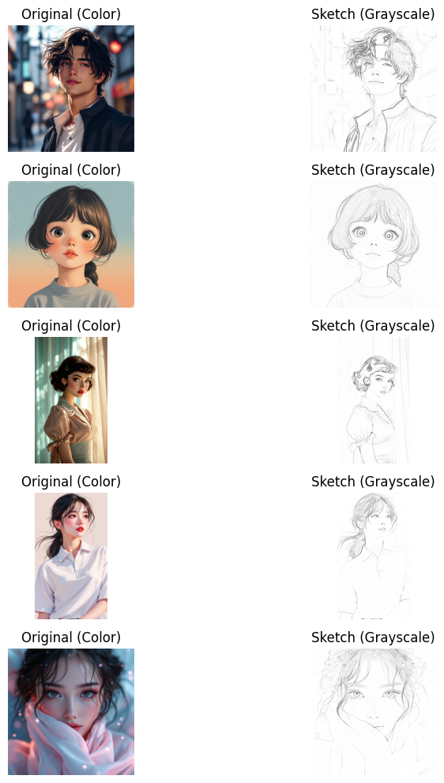

# Pix2Pix: Sketch to Image Colorization



## Overview
This project implements a **Pix2Pix Generative Adversarial Network (GAN)** to convert black-and-white sketches into fully colored images. It is based on the U-Net architecture for the generator and PatchGAN for the discriminator.

## ✨ Features
- **Pix2Pix Model:** Uses a Conditional GAN (cGAN) to transform sketches into colored images.
- **U-Net Generator:** Captures fine details while learning meaningful colorization patterns.
- **PatchGAN Discriminator:** Focuses on classifying real vs. fake image patches.
- **Data Augmentation:** Includes random flipping and jittering for better generalization.
- **TensorFlow/PyTorch Support:** Implemented using PyTorch for flexibility.

## 📂 Dataset
The dataset consists of pairs of:
- **Sketch Images** (grayscale)
- **Original Colored Images** (RGB)

The dataset is structured as:
```
dataset/
├── train/
│   ├── original/  # Real images
│   ├── sketch/    # Corresponding sketches
├── test/
│   ├── original/
│   ├── sketch/
```

## 🛠 Installation
```bash
# Clone the repository
git clone https://github.com/abdullah-khaled0/Pix2Pix-Sketch-to-Image-Colorization.git
cd Pix2Pix-Sketch-to-Image-Colorization
```

## 🚀 Training
Run the following command to start training:
```bash
python train.py
```
### Training Details
- **Epochs:** 80
- **Batch Size:** 8
- **Optimizer:** Adam (learning rate 0.0002, betas (0.5, 0.999))
- **Loss Functions:**
  - GAN Loss (BCEWithLogitsLoss)
  - L1 Loss (100x weight for reconstruction)
- **Augmentations:**
  - Random Horizontal Flip
  - Random Cropping
  - Random Jittering

## 📊 Training Progress
| Epoch | Generator Loss | Discriminator Loss |
|-------|---------------|--------------------|
| 10    | 0.35          | 50.88               |
| 50    | 0.80          | 42.0               |
| 80   | 0.91          | 43.81               |
## Results
Example of sketch-to-image colorization:

| Sketch - Generated Image
|--------|
| 

## Acknowledgments
- **Pix2Pix Paper**: [Isola et al., 2017](https://arxiv.org/abs/1611.07004)
- Dataset from [StockCake](https://stockcake.com/)

## 📜 License
This project is licensed under the MIT License.

---
🚀 **Author:** Abdullah Khaled

---
🌟 *Feel free to contribute by opening issues or pull requests!* 🚀
